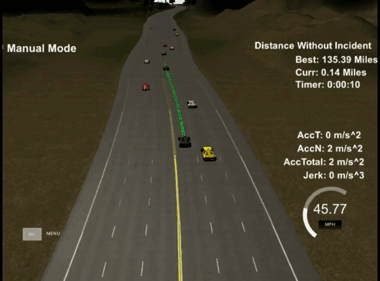
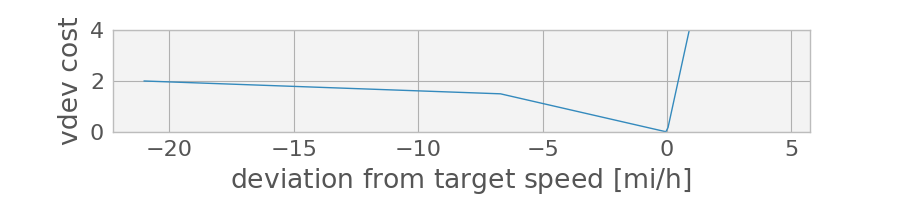

# Reactive Path Planning

  

   
## Goals
In this project the goal is to safely navigate around a virtual highway with other traffic that is driving +-10 MPH of the 50 MPH speed limit. We are provided with the car's location and the locations of its neighbors, as well as a map consisting of waypoints spaced every 30 meters along the highway's length. Sensor fusion for neighbors is perfect and noiseless, and commanded trajectories are followed exactly. 

The car should try to go as close as possible to the 50 MPH speed limit, which means passing slower traffic when possible. We must stay on our side of the road, not take too long between lanes, and limit our acceleration to below 10 m/s/s and our jerk to below 10 m/s/s/s.

See the [original forked repository](https://github.com/udacity/CarND-Path-Planning-Project) for build dependencies and other execution notes.

## Methods

Briefly, my planner takes a Monte Carlo approach, where I sample a population of candidate trajectories at each step and choose the trajectory with the lowest cost. I construct each plan to be a jerk-minimizing trajectory (JMT) per [1] for the latitudinal component *d* and longitudinal component *s* of the pose in the frame that curves with the road (the "Frenét" frame).

### Path Definition

Since the "default" action--driving straight forward--is best described as a constant longitudinal velocity and a zero latitudinal velocity, I do all planning in the Frenét coordinate system. More importantly, this allows us to choose the boundary conditions for each newly generated trajectory segment in a reasonable way.

Namely, I set the initial state and first and second derivatives (for both *s* and *d*) to match the first unreused point on the existing trajectory (right after the last reused point), and set the final *s''*, *d'*, and *d''* to zero. The final *s*, *d*, and *s'* are chosen randomly as part of my search method. These endpoints are used to [solve two uncoupled linear problems](src/jmt.cpp#L67) for the six coefficients not known in closed form for the *s* and *d* JMTs.

Therefore, my trajectories are constructed as piecewise polynomials for *s* and *d* in time, where continuity is enforced in up to the second derivative. Rather than storing these as discrete evaluated points, I use a [`Trajectory`](src/trajectory.h#L64) object that maintains a list of [`SegmentRemit`](src/trajectory.h#L57) objects. These are my piecewise segments, and each is associated with a particular half-open interval of time called its "responsibility". At construction, the endpoints of this interval correspond to the endpoints of the JMT, but this may later change as beginning portions of the plan are marked as driven and discarded, or ending portions are replanned. Offsets are maintained such that the first segment of a trajectory always begins at *t=0*.

These segments themselves eventually contain two [`PolyPath1D`](src/jmt.h#L13) objects, which store a list of six coefficients for their quintic polynomial, and enable [evaluation of any derivative](src/jmt.cpp#L21) of this polynomial at any time (including the zeroth derivative).

Emperically, I found that the code ran fastest when the `Trajectory` objects maintained a cache of their *s* and *d* evaluations ([implemented](src/trajectory.cpp#L153) using a `std::map<double, double>` from times to values),
but that caching derivatives did *not* provide a benefit.

The entire plan, consisting of multiple JMT-polynomial segments extends from `t=0` to `t=t_max()`, defined as the final JMT endpoint. However, evaluations beyond `t_max()` are possible, and are performed by projecting forward using the final *s* and *d* derivatives.

### Path Extension

Multiple times per second, I receive back from the simulator the last *x* and *y* vectors that I passed, with the driven points removed from the start. Originally, I used these directly as a starting point for my trajectory, using an integer number of these points for my reused segment. However, in order to enforce derivative continuity, it was necessary to convert these points from world coordinates to Frenét, then either take numerical derivatives or fit a polynomial and take its derivatives. 

This conversion consistently introduces noise to the process. While fixing some bugs in the world `->` Frenét conversion did help, and so did replacing the 30-meter sampled map waypoints with a more densely sampled [spline](src/coordinates.cpp#L227) through the same points, relying on the points returned from the simulator as a starting point for our newly replanned trajectory always eventually led to spurious spikes in acceleration or jerk.

So, instead, I avoided ever converting trajectories from world to Frenét coordinates, and simply reused my previously-planned Frenét-frame continous (pre-sampled) trajectory. The only piece of information required from the simulator about the past trajectory for this strategy was the *number* of unused points, from which we can infer the last used time. This provides a point at which to chop our last trajectory simply by deleting initial segments, reassigning responsibility domains, and/or shifting JMT starting points in time.

Of course, neighbor positions were still converted from world to Frenét, but, being point estimates rather than whole functions requiring continuity, this proved less of an issue.

<em>Generated trajectory from previous version of the code including a glitch introduced by buggy world-to-Frenét conversion.</em>

### Monte Carlo Search

Initially, I used a regular grid of parameters for generating a population of trajectories for costing. However, as I added variation in more parameters, the curse of dimensionality made this infeasible. Instead, I sampled a large fixed number of trajectories with random values of target lane (an integer), final speed (*s* derivative), reuse time, and JMT duration.

This approach is largely immune to the undersampling that a regular grid of comparable cardinality would have, and, as pointed out in [2], allows for further control of the planner by modifying the sampling method. As a simple demonstration of this concept, I sample final speeds not uniformly at random across the whole range of allowable values, but instead in a narrower window aroud the current speed. In the future, bimodal sampling may be useful to provide a small population of emergency-stop trajectories for consideration.

### Cost Function

After discovering and mitigating bugs introduced by the Frenét coordinate transformation, most of the work of shaping the behavior of the path planner went into defining a reasonable cost function. At the time of this writing, I have the cost components tabulated below.

|   Name   |                 Description                                                                 |
|----------|---------------------------------------------------------------------------------------------|
|`dist`    |nonlinear function of distance from neighbors                                                |
|`vdev`    |nonlinear function of deviation from goal speed                                              |
|`sw`      |static penalty on lane switching                                                             |
|`fastsw`  |extra penalty on lane switching after recent switch                                          |
|`CRP`     |shaped cost promoting lane centering and driving on-road, and favoring the center lane       |
|`maxspd`  |static cost for exceeding a speed limit                                                      |
|`maxaccel`|static cost for exceeding an acceleration limit                                              |
|`accel`   |proportional penalty on acceleration                                                         |
|`jerk`    |proportional penalty on jerk                                                                 |
|`ahead`   |static penalty on trajectories with a neighbor less than about 90 m ahead in the target lane |

These cost components are added, each with their own weighting factor, to produce a total cost for each candidate plan. Costs were evaluated in parallel over the entire candidate pool with OpenMP, resulting in a speedup from about 550 to about 160 ms per plan, after which it was feasible to increase the number of plans considered from 128 to 256.

Several of these cost components deserve elaboration.

#### `dist`

The `dist` cost, despite its name, is not simply proportional to isotropic distance from neighbors. Instead, drawing inspiration from [2], I draw bounding boxes around all cars, and impose a high cost for bounding box intersections, disregarding yaw angle. This component can be implemented with simple if/else checks on *Δd* and *Δs*. However, it should be noted that the distance involved is not the car's radii, but the full lengths or width, since the *Δd* and *Δs* are computed between centers, not edges. An early mistaken use of the former resulted in trajectories that passed very near to neighboring cars.

<em>A too-close crossing attempt generated by due to considering not Δd and Δs but Δd/2 and Δs/2. Additionally, neighboring cars projected directions are computed in world coordinates, not Frenét coordinates.</em>

In order to discourage tailgating or sudden cut-offs, I addionally impose a cost that decreases at constant rate to zero ahead and behind neighboring cars in their lane. Finally, I additionally apply a tiny such ramp to the left and right of each neighbor, to further discourage side-swiping.

<em>Cost function applied at each point in time along a trajectory for each neighbor. Costs shown are imposed when the ego car's center enters the given point.</em>

This cost is computed at each point in time along a candidate trajectory, with neighboring cars projected forward in time in Frenét coordinates rather than world coordinates using a small finite-difference approximation of their Frenét velocities from their given world velocities.

#### `vdev`

The `vdev` cost was originally proportional to absolute deviation from the goal speed, then I used a larger proportionality constant on the positive side to favor slowing down over speeding up. Finally, I used two proportionality constants on the negative side to make sharply decreased speeds much less unfavorable, while still penalizing increases to a prohibitive degree approaching the true speed limit.

  

<em>`vdev` cost function</em>

#### `CRP`

The `CRP` cost, again taking inspiration from [2], was constructed to discourage driving on lane divider lines, and sharply discourage leaving the roadway. I also build in a slight preference for the center lane, as the simulator sometimes flags normal driving in the left and right lanes as off-road.

<em>Cross-road penalty as a function of d.</em>

Between about *s=49000* and *s=5080*, I use an expit function to smoothly decrease the definition of the right lane's nominal *d* position, in an effort to drive around a problem area where these spurious off-road flags are particularly common.

## Future work

As it stands, this planner is purely reactive--no real delibration is possible, unless you count the persistence of two-second-long lane-change plans as deliberative. The code does allow for the possibility of multipart trajectories, potentially including multiple lane changes. However, naively appending a second randomly-generated JMT to each plan in the candidate pool disrupts the search for near-term-viable trajectories. An better approach, as in [2], might be similar to a graph search in the grid conformed to the Frenét coordinates, but with an added time dimension, and with using JMTs to link grid points. 

Alternately, we could overlay a coarse grid on the local highway in Frenét coordinates, with neighboring cars as obscales, use traditional A\* or other grid search methods to plan a trajectory through these cells, then use a sampling strategy biased to produced trajectories that stay roughly within these cells, potentially each containing multiple chained JMTs. Or, rather than or in addition to biasing the sampling strategy, we could dynamically alter the cost function to promote closeness to the coarse trajectory planned by A\*, similar to the [global/local framework used in ROS](http://wiki.ros.org/navigation).

I also listed a couple small enhancements to the cost function. It might be beneficial to discount costs borne far in the future compared to those more imminent, since there's a greater chance that later costs won't actually arise due to replanning. Also, in general, it might be good to add a negative cost for trajectories that take us further down the road, though this is partially accounted for already in the `vdev` cost. Finally, in order to ensure closer adherance to the kinodynamic constraints of the vehicle, it might be good to separate the acceleration costs into longitudinal and latitudinal components, as well as possibly positive and negative thresholds in the longitudinal direction, all to account for the constraint contributions of the tire friction, braking capability, and engine power particular to the actual vehicle used.

## Bibliography

[1] [Werling, Ziegler, Kammel, & Thrun. (2010). Optimal trajectory generation for dynamic street scenarios in a Frenét frame. Proceedings - IEEE International Conference on Robotics and Automation, 987–993.](https://doi.org/10.1109/ROBOT.2010.5509799)

[2] [Mcnaughton, M. (2011). Parallel Algorithms for Real-time Motion Planning Real-time Motion Planning. Doctoral thesis. Carnegie Mellon University.](http://citeseerx.ist.psu.edu/viewdoc/download?doi=10.1.1.269.6348&rep=rep1&type=pdf)