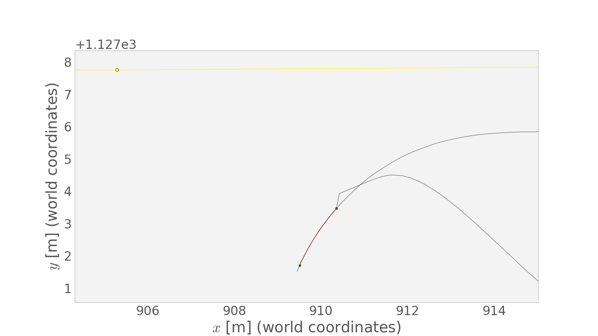

# CarND-Path-Planning-Project
[](http://www.udacity.com/drive)
   
## Goals
In this project the goal is to safely navigate around a virtual highway with other traffic that is driving +-10 MPH of the 50 MPH speed limit. We are provided with the car's location and the locations of its neighbors, as well as a map consisting of waypoints spaced every 30 meters along the highway's length. The car should try to go as close as possible to the 50 MPH speed limit, which means passing slower traffic when possible. We must stay on our side of the road, not take too long between lanes, and limit our acceleration to below 10 m/s/s and our jerk to below 10 m/s/s/s.

## Methods

Briefly, my planner takes a Monte Carlo approach, where I sample a population of candidate trajectories at each step and choose the trajectory with the lowest cost. I construct each plan to be a jerk-minimizing trajectory (JMT) per [1] for the latitudinal component *d* and longitudinal component *s* of the pose in the frame that curves with the road (the "Frenét" frame).

### Path Definition

Since the "default" action--driving straight forward--is best described as a constant longitudinal velocity and a zero latitudinal velocity, I do all planning in the Frenét coordinate system. More importantly, this allows us to choose the boundary conditions for each newly generated trajectory segment in a reasonable way.

Namely, I set the initial state and first and second derivatives (for both *s* and *d*) to match the first unreused point on the existing trajectory (right after the last reused point), and set the final *s''*, *d'*, and *d''* to zero. The final *s*, *d*, and *s'* are chosen randomly as part of my search method.

Therefore, my trajectories are constructed as piecewise polynomials for *s* and *d* in time, where continuity is enforced in up to the second derivative. Rather than storing these as discrete evaluated points, I use a `Trajectory` object that maintains a list of `SegmentRemit` objects. These are my piecewise segments, and each is associated with a particular half-open interval of time called its "responsibility". At construction, the endpoints of this interval correspond to the endpoints of the JMT, but this may later change as beginning portions of the plan are marked as driven and discarded, or ending portions are replanned. Offsets are maintained such that the first segment of a trajectory always begins at *t=0*.

These segments themselves eventually contain two `PolyPath1D` objects, which store a list of six coefficients for their quintic polynomial, and enable evaluation of any derivative of this polynomial at any time (including the zeroth derivative).

Emperically, I found that the code ran fastest when the `Trajectory` objects maintained a cache of their *s* and *d* evaluations (implemented using a `std::map<double, double>` from times to values),
but that caching derivatives did *not* provide a benefit.

The entire plan, consisting of multiple JMT-polynomial segments extends from `t=0` to `t=t_max()`, defined as the final JMT endpoint. However, evaluations beyond `t_max()` are possible, and are performed by projecting forward using the final *s* and *d* derivatives.


### Path Extension

Multiple times per second, I receive back from the simulator the last *x* and *y* vectors that I passed, with the driven points removed from the start. Originally, I used these directly as a starting point for my trajectory, using an integer number of these points for my reused segment. However, in order to enforce derivative continuity, it was necessary to convert these points from world coordinates to Frenét, then either take numerical derivatives or fit a polynomial and take its derivatives. 

This conversion consistently introduces noise to the process. While fixing some bugs in the world `->` Frenét conversion did help, and so did replacing the 30-meter sampled map waypoints with a more densely sampled spline through the same points, relying on the points returned from the simulator as a starting point for our newly replanned trajectory always eventually led to spurious spikes in acceleration or jerk.

So, instead, I avoided ever converting trajectories from world to Frenét coordinates, and simply reused my previously-planned Frenét-frame continous (pre-sampled) trajectory. The only piece of information required from the simulator about the past trajectory for this strategy was the *number* of unused points, from which we can infer the last used time. This provides a point at which to chop our last trajectory simply by deleting initial segments, reassigning responsibility domains, and/or shifting JMT starting points in time.

Of course, neighbor positions were still converted from world to Frenét, but, being point estimates rather than whole functions requiring continuity, this proved less of an issue.



<p align="center">*Generated trajectory from previous version of the code including a glitch introduced by buggy world-to-Frenét conversion.*</p>


### Monte Carlo Search

Initially, I used a regular grid of parameters for generating a population of trajectories for costing. However, as I added variation in more parameters, the curse of dimensionality made this infeasible. Instead, I sampled a large fixed number of trajectories with random values of target lane (an integer), final speed (*s* derivative), reuse time, and JMT duration.

This approach is largely immune to the undersampling that a regular grid of comparable cardinality would have, and, as pointed out in [2], allows for further control of the planner by modifying the sampling method. As a simple demonstration of this concept, I sample final speeds not uniformly at random across the whole range of allowable values, but instead in a narrower window aroud the current speed. In the future, bimodal sampling may be useful to provide a small population of emergency-stop trajectories for consideration.


### Cost Function

After discovering and mitigating bugs introduced by the Frenét coordinate transformation, most of the work of shaping the behavior of the path planner went into defining a reasonable cost function. At the time of this writing, I have the cost components tabulated below.

| Name     | Description |
|----------|-------------|
|`dist`    |nonlinear function of distance from neighbors|
|`vdev`    |nonlinear function of deviation from goal speed|
|`sw`      |static penalty on lane switching|
|`fastsw`  |extra penalty on lane switching after recent switch|
|`CRP`     |shaped cost promoting lane centering and driving on-road, and favoring the center lane|
|`maxspd`  |static cost for exceeding a speed limit|
|`maxaccel`|static cost for exceeding an acceleration limit|
|`accel`   |proportional penalty on acceleration|
|`jerk`    |proportional penalty on jerk|
|`ahead`   |static penalty on trajectories with a neighbor less than about 90 m ahead in the target lane|

Several of these components deserve elaboration.

<p align="center">

</p>
<p align="center"><em>Cross-road penalty.</em></p>


## Basic Build Instructions

1. Clone this repo.
2. Make a build directory: `mkdir build && cd build`
3. Compile: `cmake .. && make`
4. Run it: `./path_planning`.

Here is the data provided from the Simulator to the C++ Program

#### Main car's localization Data (No Noise)

["x"] The car's x position in map coordinates

["y"] The car's y position in map coordinates

["s"] The car's s position in Frenét coordinates

["d"] The car's d position in Frenét coordinates

["yaw"] The car's yaw angle in the map

["speed"] The car's speed in MPH

#### Previous path data given to the Planner

//Note: Return the previous list but with processed points removed, can be a nice tool to show how far along
the path has processed since last time. 

["previous_path_x"] The previous list of x points previously given to the simulator

["previous_path_y"] The previous list of y points previously given to the simulator

#### Previous path's end s and d values 

["end_path_s"] The previous list's last point's Frenét s value

["end_path_d"] The previous list's last point's Frenét d value

#### Sensor Fusion Data, a list of all other car's attributes on the same side of the road. (No Noise)

["sensor_fusion"] A 2d vector of cars and then that car's [car's unique ID, car's x position in map coordinates, car's y position in map coordinates, car's x velocity in m/s, car's y velocity in m/s, car's s position in Frenét coordinates, car's d position in Frenét coordinates. 

## Details

1. The car uses a perfect controller and will visit every (x,y) point it recieves in the list every .02 seconds. The units for the (x,y) points are in meters and the spacing of the points determines the speed of the car. The vector going from a point to the next point in the list dictates the angle of the car. Acceleration both in the tangential and normal directions is measured along with the jerk, the rate of change of total Acceleration. The (x,y) point paths that the planner recieves should not have a total acceleration that goes over 10 m/s^2, also the jerk should not go over 50 m/s^3. (NOTE: As this is BETA, these requirements might change. Also currently jerk is over a .02 second interval, it would probably be better to average total acceleration over 1 second and measure jerk from that.

2. There will be some latency between the simulator running and the path planner returning a path, with optimized code usually its not very long maybe just 1-3 time steps. During this delay the simulator will continue using points that it was last given, because of this its a good idea to store the last points you have used so you can have a smooth transition. previous_path_x, and previous_path_y can be helpful for this transition since they show the last points given to the simulator controller with the processed points already removed. You would either return a path that extends this previous path or make sure to create a new path that has a smooth transition with this last path.

## Tips

A really helpful resource for doing this project and creating smooth trajectories was using http://kluge.in-chemnitz.de/opensource/spline/, the spline function is in a single hearder file is really easy to use.

---

## Dependencies

* cmake >= 3.5
  * All OSes: [click here for installation instructions](https://cmake.org/install/)
* make >= 4.1
  * Linux: make is installed by default on most Linux distros
  * Mac: [install Xcode command line tools to get make](https://developer.apple.com/xcode/features/)
  * Windows: [Click here for installation instructions](http://gnuwin32.sourceforge.net/packages/make.htm)
* gcc/g++ >= 5.4
  * Linux: gcc / g++ is installed by default on most Linux distros
  * Mac: same deal as make - [install Xcode command line tools]((https://developer.apple.com/xcode/features/)
  * Windows: recommend using [MinGW](http://www.mingw.org/)
* [uWebSockets](https://github.com/uWebSockets/uWebSockets)
  * Run either `install-mac.sh` or `install-ubuntu.sh`.
  * If you install from source, checkout to commit `e94b6e1`, i.e.
    ```
    git clone https://github.com/uWebSockets/uWebSockets 
    cd uWebSockets
    git checkout e94b6e1
    ```
## Bibliography

[1] Werling, Ziegler, Kammel, & Thrun. (2010). Optimal trajectory generation for dynamic street scenarios in a Frenét frame. Proceedings - IEEE International Conference on Robotics and Automation, 987–993. https://doi.org/10.1109/ROBOT.2010.5509799

[2] Mcnaughton, M. (2011). Parallel Algorithms for Real-time Motion Planning Real-time Motion Planning. Doctoral thesis. Carnegie Mellon University.